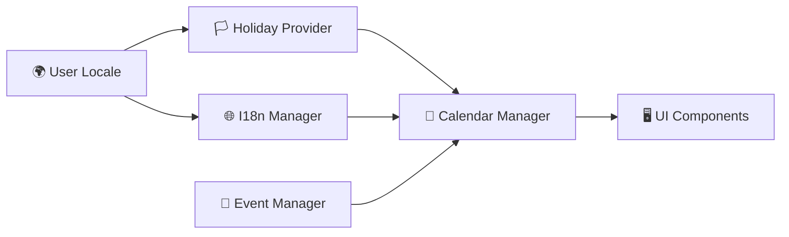

# 📅 Calendifier

**Author: Oliver Ernster**

### If you like it please buy me a coffee: [Donation link](https://www.paypal.com/ncp/payment/UNU78VKKJ49SY)

<!-- Multi-language summary -->
**🇺🇸 English (US):** Cross-platform desktop calendar and Home Assistant integration with analog clock, event handling, note taking, and holidays

**🇬🇧 English (UK):** Cross-platform desktop calendar and Home Assistant integration with analogue clock, event handling, note taking, and holidays

**🇪🇸 Español:** Calendario de escritorio multiplataforma e integración Asistente del Hogar con reloj analógico, gestión de eventos, toma de notas y días festivos

**🇫🇷 Français:** Calendrier de bureau multiplateforme et intégration Assistant Domestique avec horloge analogique, gestion d'événements, prise de notes et jours fériés

**🇩🇪 Deutsch:** Plattformübergreifender Desktop-Kalender und Heim-Assistent-Integration mit analoger Uhr, Ereignisbehandlung, Notizen und Feiertagen

**🇮🇹 Italiano:** Calendario desktop multipiattaforma e integrazione Assistente Domestico con orologio analogico, gestione eventi, presa di note e festività

**🇧🇷 Português:** Calendário de desktop multiplataforma e integração Assistente Doméstico com relógio analógico, manipulação de eventos, anotações e feriados

**🇷🇺 Русский:** Кроссплатформенный настольный календарь и интеграция Домашний Помощник с аналоговыми часами, обработкой событий, заметками и праздниками

**🇨🇳 简体中文:** 具有模拟时钟、事件处理、记笔记和节假日功能的跨平台桌面日历和家庭助手集成

**🇹🇼 繁體中文:** 具有類比時鐘、事件處理、記筆記和節假日功能的跨平台桌面日曆和家庭助理整合

**🇯🇵 日本語:** アナログ時計、イベント処理、ノート取り、祝日機能を備えたクロスプラットフォームデスクトップカレンダーとホームアシスタント統合

**🇰🇷 한국어:** 아날로그 시계, 이벤트 처리, 메모 작성 및 휴일 기능을 갖춘 크로스 플랫폼 데스크톱 캘린더 및 홈 어시스턴트 통합

**🇮🇳 हिन्दी:** एनालॉग घड़ी, इवेंट हैंडलिंग, नोट लेने और छुट्टियों के साथ क्रॉस-प्लेटफॉर्म डेस्कटॉप कैलेंडर और होम असिस्टेंट एकीकरण

**🇸🇦 العربية:** تقويم سطح المكتب متعدد المنصات وتكامل المساعد المنزلي مع ساعة تناظرية ومعالجة الأحداث وتدوين الملاحظات والعطلات

---

## 🌟 Overview

**Calendifier** is a sophisticated calendar system available in two deployment modes:

1. **🖥️ Desktop Application** - Cross-platform desktop calendar built with Python and PySide6
2. **🏠 Home Assistant Integration** - Web-based dashboard cards for Home Assistant with beautiful UI

Both versions feature comprehensive internationalization supporting **14 languages** and **14 countries**, making it a truly global calendar solution.

### ✨ Key Features

- 📅 **Full Calendar Management** - Monthly view with intuitive navigation
- 🌍 **14-Language Support** - Complete localization with runtime language switching
- 🏳️ **14-Country Holiday Support** - Intelligent holiday detection with native translations
- 🕐 **Real-time Analog Clock** - NTP synchronization for accurate timekeeping
- 📝 **Comprehensive Event Management** - Create, edit, delete with categories and recurring events
- 🎨 **Dynamic Theming** - Dark/Light mode with instant switching
- 📝 **Integrated Notes** - Built-in note-taking functionality
- 📤📥 **Import/Export** - Support for iCalendar, CSV, and JSON formats
- ⚙️ **Extensive Configuration** - Customizable settings for all preferences

## 🌍 International Support

### 🗣️ Supported Languages
- **🇺🇸🇬🇧 English** (US & UK variants)
- **🇪🇸 Español** (Spanish)
- **🇫🇷 Français** (French)
- **🇩🇪 Deutsch** (German)
- **🇮🇹 Italiano** (Italian)
- **🇧🇷 Português** (Brazilian Portuguese)
- **🇷🇺 Русский** (Russian)
- **🇨🇳 简体中文** (Simplified Chinese)
- **🇹🇼 繁體中文** (Traditional Chinese)
- **🇯🇵 日本語** (Japanese)
- **🇰🇷 한국어** (Korean)
- **🇮🇳 हिन्दी** (Hindi)
- **🇸🇦 العربية** (Arabic)

### 🏳️ Holiday Support
The application automatically detects and displays holidays for 14 countries with intelligent cultural filtering:

| Country | Holidays | Cultural Filtering |
|---------|----------|-------------------|
| 🇺🇸 United States | Federal holidays | ✅ |
| 🇬🇧 United Kingdom | Bank holidays | ✅ |
| 🇪🇸 Spain | National holidays | ✅ |
| 🇫🇷 France | Jours fériés | ✅ |
| 🇩🇪 Germany | Feiertage | ✅ |
| 🇮🇹 Italy | Giorni festivi | ✅ |
| 🇧🇷 Brazil | Feriados nacionais | ✅ |
| 🇷🇺 Russia | Праздничные дни | ✅ |
| 🇨🇳 China | 法定节假日 | ✅ |
| 🇹🇼 Taiwan | 國定假日 | ✅ |
| 🇯🇵 Japan | 祝日 | ✅ |
| 🇰🇷 South Korea | 공휴일 | ✅ |
| 🇮🇳 India | राष्ट्रीय अवकाश | ✅ |
| 🇸🇦 Saudi Arabia | الأعياد الوطنية | ✅ |

## Screen shot


## 🚀 Quick Start

Choose your preferred deployment method:

## 🏠 Home Assistant Deployment (Recommended)

Deploy Calendifier as beautiful dashboard cards in Home Assistant for web-based access.

### 📋 Prerequisites
- **Raspberry Pi** or **Linux server** with Docker
- **SSH access** to your server
- **Windows PC or Mac or Linux box** for deployment script

### 🔧 Home Assistant Installation

1. **Clone the repository:**
   ```
   git clone https://github.com/oernster/calendifier.git
   cd calendifier
   ```

2. **Deploy to your Pi/Server:**
   ```powershell
   .\deploy-ha.ps1
   ```
   **or for linux/mac:**
   ```sh
   ./deploy-ha.sh
   ```
   Enter your Pi's IP address when prompted.

4. **SSH to your Pi and run setup:**
   ```bash
   ssh pi@your-pi-ip
   cd calendifier
   ./setup-pi.sh
   ```

5. **Access your calendar:**
   - Open Home Assistant: `http://your-pi-ip:8123`
   - Complete Home Assistant setup wizard
   - Click **"Calendifier"** in the left sidebar
   - Enjoy your beautiful calendar dashboard!

### ✨ Home Assistant Features
- 🎨 **Beautiful Dashboard Cards** - Clock, Calendar, Events, Notes, Settings, Data Management
- 📱 **Responsive Design** - Works on desktop, tablet, and mobile
- 🌐 **Web Access** - Access from anywhere on your network
- 🔄 **Auto-Updates** - Cards refresh automatically
- 🎯 **Optimized Layout** - No overlapping, proper spacing

---

## 🖥️ Desktop Application

Traditional desktop application for local use.

### 📋 Prerequisites

- **Python 3.8+**
- **PySide6** (Qt6 for Python)
- **Windows 10+**, **macOS 10.14+**, or **Linux** (Ubuntu 18.04+)

### 🔧 Desktop Installation

1. **Clone the repository:**
   ```bash
   git clone https://github.com/oernster/calendifier.git
   cd calendifier
   ```

2. **Install dependencies:**
   ```bash
   pip install -r requirements.txt
   ```

3. **Run the application:**
   ```bash
   python main.py
   ```

### 🎯 First Launch

On first launch, the application will:
- 🔍 **Auto-detect your system locale** and set the appropriate language
- 🏳️ **Match your country** to display relevant holidays
- 🎨 **Apply your system theme** (dark/light mode)
- 📁 **Create user data directory** at `~/.calendar_app/`

## 📱 Screenshots

### 🌙 Dark Theme


### ☀️ Light Theme


### 🌍 Language Switching


### 📝 Event Management


## 🏗️ Architecture

This application features a sophisticated modular architecture with emphasis on internationalization and cultural awareness. For detailed technical documentation, see **[📖 Architecture Documentation](docs/architecture.md)**.

### 🧩 Key Components

- **🌍 I18n Manager** - Advanced internationalization with runtime language switching
- **🏳️ Holiday Provider** - Multi-country holiday system with cultural filtering
- **📅 Calendar Manager** - Calendar logic with event and holiday integration
- **📝 Event Manager** - Full CRUD operations with recurring event support
- **🎨 Theme Manager** - Dynamic theming system
- **🗄️ Database Manager** - SQLite with schema versioning

### 🔄 Data Flow



## 🛠️ Development

### 🏃‍♂️ Running from Source

```bash
# Clone repository
git clone https://github.com/oernster/calendifier.git
cd calendifier

# Create virtual environment
python -m venv venv
source venv/bin/activate  # On Windows: venv\Scripts\activate

# Install dependencies
pip install -r requirements.txt

# Run application
python main.py
```

### 🌍 Adding New Languages

1. Create translation file: `calendar_app/localization/translations/{locale}.json`
2. Add holiday translations: `calendar_app/localization/locale_holiday_translations/{locale}_holidays.json`
3. Update supported locales in `LocaleDetector`
4. Test language switching functionality

See [Architecture Documentation](docs/architecture.md#-adding-new-languages) for detailed instructions.

## 📦 Building & Distribution

Calendifier supports multiple build targets for maximum compatibility across platforms:

### 🖥️ Cross-Platform Executable (Nuitka)

Build a single executable file for Windows, macOS, and Linux:

```bash
# Standard build
python build.py

# Debug build with verbose output
python build.py --debug

# Clean build
python build.py --clean
```

**Output**: Single executable file in `dist/` directory

### 📦 Linux Flatpak Package

Build a universal Flatpak package for all Linux distributions using the bash script:

```bash
# Make the build script executable (on Linux)
chmod +x build_flatpak.sh

# Run the build script with automatic dependency installation
./build_flatpak.sh
```

**Output**: `.flatpak` bundle and repository in project directory

**Supported Distributions**:
- Debian/Ubuntu/Linux Mint/Pop!_OS
- Fedora/RHEL/CentOS/Rocky/AlmaLinux
- Arch Linux/EndeavourOS/Manjaro
- openSUSE (Leap/Tumbleweed)
- Void Linux

📖 **Detailed Instructions**: See [`FLATPAK_BUILD_README.md`](FLATPAK_BUILD_README.md)

**🔧 Build Script Features:**
- **Automatic Distribution Detection** - Detects your Linux distribution and configures accordingly
- **Desktop Environment Integration** - Optimizes for GNOME, KDE, Cinnamon, etc.
- **Dependency Management** - Automatically installs required Flatpak runtimes
- **Cross-Distribution Support** - Works on all major Linux distributions
- **Interactive Installation** - Prompts to install the built package automatically

## 📦 Legacy Build Information (Nuitka)

Calendifier includes a Nuitka build script that creates a single executable file while complying with PySide6's LGPL3 license requirements:

### 🔧 Build Requirements

```bash
# Install Nuitka (required for building)
pip install nuitka
```

### 🚀 Build Commands

```bash
# Standard build - creates single executable with progress monitoring
python build.py

# Debug build - shows verbose compilation output
python build.py --debug

# Clean build - removes all build artifacts first
python build.py --clean
```

### ✨ Build Features

**🎯 Single File Output:**
- Creates **one executable file** (`calendifier.exe` on Windows)
- **No additional .dll or .pyd files** in distribution
- **Clean dist directory** with only essential files

**📊 Real-time Progress:**
- **Visual progress indicators** during compilation
- **Animated spinner** for long compilation phases
- **Heartbeat messages** every 30 seconds
- **Detailed progress parsing** of Nuitka output

**⚖️ LGPL3 Compliance:**
- ✅ **License documentation** in dist root
- ✅ **Source code availability** notice included
- ✅ **Library replacement** instructions provided
- ✅ **Compliance notice** with build timestamp

### 📁 Build Output

After successful build, the `dist/` directory contains exactly:
```
dist/
├── calendifier.exe                    # Main executable
├── CALENDIFIER_LICENSE.txt           # Application license
└── LGPL3_COMPLIANCE_NOTICE.txt       # LGPL compliance documentation
```

**Build Process:**
1. **Cleans** dist directory completely
2. **Compiles** with Nuitka using `--onefile` mode
3. **Includes** all translation files and assets
4. **Creates** LGPL compliance documentation
5. **Removes** any extra build artifacts
6. **Shows** final file listing and size information


## 📦 Project Structure

```
calendifier/
├── 📄 main.py                    # Application entry point
├── 📄 version.py                 # Version and metadata
├── 📄 requirements.txt           # Dependencies
├── 📁 calendar_app/              # Main application package
│   ├── 📁 core/                  # Business logic
│   │   ├── 📄 calendar_manager.py
│   │   ├── 📄 event_manager.py
│   │   └── 📄 multi_country_holiday_provider.py
│   ├── 📁 ui/                    # User interface
│   │   ├── 📄 main_window.py
│   │   ├── 📄 calendar_widget.py
│   │   └── 📄 clock_widget.py
│   ├── 📁 data/                  # Data layer
│   │   ├── 📄 database.py
│   │   └── 📄 models.py
│   ├── 📁 config/                # Configuration
│   │   ├── 📄 settings.py
│   │   └── 📄 themes.py
│   ├── 📁 localization/          # Internationalization
│   │   ├── 📄 i18n_manager.py
│   │   ├── 📁 translations/      # Translation files
│   │   └── 📁 locale_holiday_translations/
│   └── 📁 utils/                 # Utilities
├── 📁 assets/                    # Application assets
├── 📁 docs/                      # Documentation
│   └── 📄 architecture.md        # Technical architecture
└── 📁 tests/                     # Test suite
```

## ⚙️ Configuration

### 🏠 User Data Location

The application stores user data in:
- **Windows:** `%USERPROFILE%\.calendar_app\`
- **macOS:** `~/.calendar_app/`
- **Linux:** `~/.calendar_app/`

### 📁 Configuration Files

- **`settings.json`** - Application preferences
- **`data/calendar.db`** - SQLite database
- **`logs/`** - Application logs
- **`exports/`** - Exported calendar files
- **`backups/`** - Database backups

## 🤝 Contributing

I welcome contributions! Please see the [Contributing Guidelines](CONTRIBUTING.md) for details.

### 🐛 Bug Reports

Please use the [GitHub Issues](https://github.com/oernster/calendifier/issues) page to report bugs. Include:
- Operating system and version
- Python version
- Steps to reproduce
- Expected vs actual behavior
- Screenshots if applicable

### 💡 Feature Requests

I'm always looking to improve! Submit feature requests via [GitHub Issues](https://github.com/oernster/calendifier/issues) with the "enhancement" label.

### 🌍 Translations

Help me support more languages! See [Adding New Languages](docs/architecture.md#-adding-new-languages) in the architecture documentation.

## 📄 License

This project is licensed under the MIT License - see the [LICENSE](LICENSE) file for details.

## 🙏 Acknowledgments

- **[PySide6](https://doc.qt.io/qtforpython/)** - Qt6 Python bindings
- **[Python holidays](https://python-holidays.readthedocs.io/)** - Holiday data library
- **[ntplib](https://pypi.org/project/ntplib/)** - NTP client library
- **[icalendar](https://icalendar.readthedocs.io/)** - iCalendar format support

## 📞 Support

- 📖 **Documentation:** [Architecture Guide](docs/architecture.md)
- 🐛 **Issues:** [GitHub Issues](https://github.com/oernster/calendifier/issues)
- 💬 **Discussions:** [GitHub Discussions](https://github.com/oernster/calendifier/discussions)

---

<div align="center">

**Made with ❤️ for the global community**

*Supporting 14 languages and 14 countries worldwide*

[🌍 View Architecture](docs/architecture.md) • [🚀 Quick Start](#-quick-start) • [🤝 Contributing](#-contributing)

</div>
