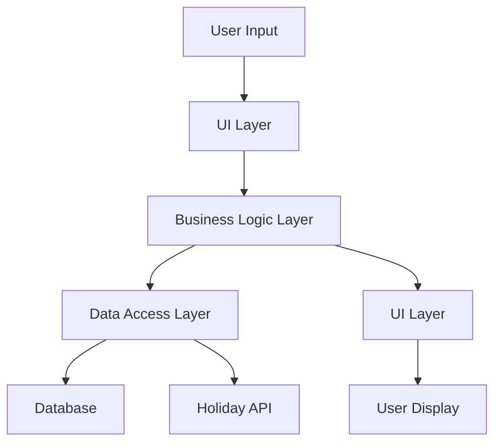
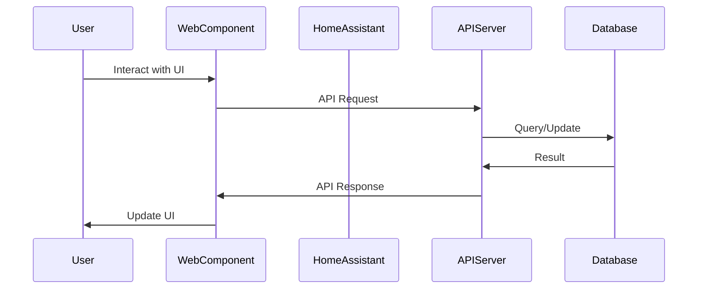

# 📅 Calendifier Architecture Documentation

## Overview

Calendifier is a sophisticated calendar system available in two deployment modes:

1. **🖥️ Desktop Application** - Cross-platform desktop calendar built with Python and PySide6
2. **🏠 Home Assistant Integration** - Web-based dashboard cards for Home Assistant with beautiful UI

Both versions feature comprehensive internationalization supporting **40 languages** and **40 countries**, making it a truly global calendar solution.

This document provides a detailed architecture overview of both deployment modes, explaining the core components, data flow, and integration points.

## Table of Contents

- [Core Architecture](#core-architecture)
  - [Component Overview](#component-overview)
  - [Data Flow](#data-flow)
  - [Directory Structure](#directory-structure)
- [Desktop Application Architecture](#desktop-application-architecture)
  - [Application Lifecycle](#application-lifecycle)
  - [UI Components](#ui-components)
  - [Core Services](#core-services)
  - [Data Persistence](#data-persistence)
- [Home Assistant Integration Architecture](#home-assistant-integration-architecture)
  - [Deployment Architecture](#deployment-architecture)
  - [API Server](#api-server)
  - [Web Components](#web-components)
  - [Data Flow](#ha-data-flow)
- [Internationalization Architecture](#internationalization-architecture)
  - [Translation System](#translation-system)
  - [Locale Detection](#locale-detection)
  - [Number Formatting](#number-formatting)
- [Recurring Events Architecture](#recurring-events-architecture)
  - [RRule Implementation](#rrule-implementation)
  - [Event Expansion](#event-expansion)
- [Security Considerations](#security-considerations)
- [Performance Optimizations](#performance-optimizations)
- [Future Extensibility](#future-extensibility)

## Core Architecture

Calendifier is built on a modular architecture that separates concerns between data management, business logic, and presentation. This allows for code reuse between the desktop application and Home Assistant integration.

### Component Overview


The core components of Calendifier are:

1. **🌍 I18n Manager** - Handles internationalization with 40 languages
2. **🏳️ Holiday Provider** - Provides holiday data for 40 countries
3. **📅 Calendar Manager** - Manages calendar logic and event integration
4. **📝 Event Manager** - Handles event CRUD operations
5. **🎨 Theme Manager** - Manages UI themes (dark/light)
6. **🗄️ Database Manager** - Handles data persistence

These components are shared between both deployment modes, ensuring consistent behavior and features.

### Data Flow



The data flow follows a clean architecture pattern:

1. User input is captured by the UI layer
2. Requests are passed to the business logic layer
3. Data is retrieved or modified through the data access layer
4. Results are returned to the UI layer for display

### Directory Structure

```
calendifier/
├── 📄 main.py                    # Desktop application entry point
├── 📄 api_server.py              # Home Assistant API server
├── 📄 version.py                 # Version and metadata
├── 📁 calendar_app/              # Main application package
│   ├── 📁 core/                  # Business logic
│   │   ├── 📄 calendar_manager.py
│   │   ├── 📄 event_manager.py
│   │   └── 📄 multi_country_holiday_provider.py
│   ├── 📁 ui/                    # Desktop UI components
│   │   ├── 📄 main_window.py
│   │   ├── 📄 calendar_widget.py
│   │   └── 📄 clock_widget.py
│   ├── 📁 data/                  # Data layer
│   │   ├── 📄 database.py
│   │   └── 📄 models.py
│   ├── 📁 config/                # Configuration
│   │   ├── 📄 settings.py
│   │   └── 📄 themes.py
│   ├── 📁 localization/          # Internationalization
│   │   ├── 📄 i18n_manager.py
│   │   ├── 📁 translations/      # Translation files
│   │   └── 📁 locale_holiday_translations/
│   └── 📁 utils/                 # Utilities
├── 📁 www/                       # Home Assistant web components
│   ├── 📄 calendifier-base-card.js
│   ├── 📄 calendifier-calendar-card.js
│   ├── 📄 calendifier-events-card.js
│   └── 📄 rrule-builder.js
├── 📁 assets/                    # Application assets
└── 📁 docs/                      # Documentation
```

## Desktop Application Architecture

The desktop application is built using Python with PySide6 (Qt6) for the user interface. It follows a Model-View-Controller (MVC) pattern to separate data, business logic, and presentation.

### Application Lifecycle


The application lifecycle is managed by the `CalendarApplication` class in `main.py`:

1. **Initialization**:
   - Setup environment and directories
   - Configure logging
   - Initialize application components asynchronously

2. **Component Initialization**:
   - Database setup
   - Settings loading
   - Theme initialization
   - Locale detection and translation loading
   - Holiday provider setup

3. **UI Creation**:
   - Main window creation
   - Widget initialization
   - Component dependency injection

4. **Runtime**:
   - Event handling
   - User interaction
   - Periodic updates (NTP sync, etc.)

5. **Shutdown**:
   - Resource cleanup
   - Settings persistence

For more details, see [Desktop Application Lifecycle](desktop-application-lifecycle.md).

### UI Components

The desktop UI is composed of several key components:

1. **Main Window** (`main_window.py`):
   - Main application window
   - Layout management
   - Menu and toolbar

2. **Calendar Widget** (`calendar_widget.py`):
   - Monthly calendar view
   - Day selection
   - Event display
   - Holiday integration

3. **Clock Widget** (`clock_widget.py`):
   - Analog clock display
   - NTP synchronization
   - Time zone support

4. **Event Panel** (`event_panel.py`):
   - Event list display
   - Event creation/editing
   - Event filtering

5. **Notes Widget** (`notes_widget.py`):
   - Note taking functionality
   - Note categorization
   - Note search

6. **Settings Dialog** (`settings_dialog.py`):
   - Application preferences
   - Language selection
   - Theme selection
   - Holiday country selection

For more details, see [Desktop UI Components](desktop-ui-components.md).

### Core Services

The desktop application relies on several core services:

1. **Calendar Manager** (`calendar_manager.py`):
   - Calendar navigation
   - Date calculations
   - Holiday integration
   - Event integration

2. **Event Manager** (`event_manager.py`):
   - Event CRUD operations
   - Event search
   - Recurring event handling
   - Import/export functionality

3. **Holiday Provider** (`multi_country_holiday_provider.py`):
   - Holiday data for 40 countries
   - Holiday translations
   - Weekend detection
   - Cultural filtering

4. **I18n Manager** (`i18n_manager.py`):
   - Translation loading
   - Locale detection
   - Runtime language switching
   - Number formatting

5. **Theme Manager** (`themes.py`):
   - Theme switching (dark/light)
   - Custom color schemes
   - Dynamic stylesheet generation

6. **NTP Client** (`ntp_client.py`):
   - Time synchronization
   - Server selection
   - Fallback mechanisms

For more details, see [Desktop Core Services](desktop-core-services.md).

### Data Persistence

The desktop application uses SQLite for data persistence:

1. **Database Manager** (`database.py`):
   - Connection management
   - Schema creation and migration
   - Query execution

2. **Data Models** (`models.py`):
   - Event model
   - Note model
   - Holiday model
   - Calendar models

3. **Settings Manager** (`settings.py`):
   - Settings persistence
   - Default values
   - Settings validation

Data is stored in the user's home directory:
- **Windows:** `%USERPROFILE%\.calendar_app\`
- **macOS/Linux:** `~/.calendar_app/`

For more details, see [Desktop Data Persistence](desktop-data-persistence.md).

## Home Assistant Integration Architecture

The Home Assistant integration consists of two main components:

1. **API Server** - Python FastAPI server providing calendar data
2. **Web Components** - JavaScript components for Home Assistant Lovelace UI

### Deployment Architecture


The Home Assistant integration is deployed using Docker containers:

1. **Calendifier API Container**:
   - FastAPI server
   - SQLite database
   - Holiday provider
   - Event manager

2. **Home Assistant Container**:
   - Home Assistant core
   - Lovelace UI
   - Calendifier web components

The deployment process is handled by the `deploy-ha.sh` (Linux/Mac) or `Deploy-HA.ps1` (Windows) scripts, which:

1. Package the application files
2. Transfer them to the target server
3. Run the `setup-pi.sh` script to:
   - Create Docker containers
   - Configure Home Assistant
   - Set up the Lovelace dashboard

For more details, see [Home Assistant Deployment](home-assistant-deployment.md).

### API Server

The API server (`api_server.py`) is built using FastAPI and provides the following endpoints:

1. **Events API**:
   - GET `/api/v1/events` - Get all events
   - POST `/api/v1/events` - Create new event
   - PUT `/api/v1/events/{event_id}` - Update event
   - DELETE `/api/v1/events/{event_id}` - Delete event
   - GET `/api/v1/events/expanded` - Get events with recurring events expanded

2. **Notes API**:
   - GET `/api/v1/notes` - Get all notes
   - POST `/api/v1/notes` - Create new note
   - DELETE `/api/v1/notes/{note_id}` - Delete note

3. **Holidays API**:
   - GET `/api/v1/holidays/{country}/{year}/{month}` - Get holidays for month
   - GET `/api/v1/holidays/auto/{year}` - Get holidays for year (auto-detect country)
   - GET `/api/v1/holidays/countries` - Get supported countries

4. **Settings API**:
   - GET `/api/v1/settings` - Get all settings
   - PUT `/api/v1/settings` - Update settings

5. **Translations API**:
   - GET `/api/v1/translations` - Get available translations
   - GET `/api/v1/translations/{locale}` - Get translations for locale

6. **NTP API**:
   - GET `/api/v1/ntp/status` - Get NTP status
   - POST `/api/v1/ntp/sync` - Trigger NTP sync

7. **Import/Export API**:
   - GET `/api/v1/export/events` - Export events
   - GET `/api/v1/export/notes` - Export notes
   - GET `/api/v1/export/all` - Export all data
   - POST `/api/v1/import/events` - Import events
   - POST `/api/v1/import/notes` - Import notes

For more details, see [API Server Documentation](api-server-documentation.md).

### Web Components

The web components are built using JavaScript and integrate with Home Assistant's Lovelace UI:

1. **Base Card** (`calendifier-base-card.js`):
   - Common functionality for all cards
   - Translation support
   - Event handling
   - API communication

2. **Calendar Card** (`calendifier-calendar-card.js`):
   - Monthly calendar view
   - Event display
   - Holiday integration
   - Navigation controls

3. **Events Card** (`calendifier-events-card.js`):
   - Event list display
   - Event creation/editing
   - Event filtering
   - Recurring event support

4. **Clock Card** (`calendifier-clock-card.js`):
   - Analog clock display
   - NTP synchronization
   - Time zone support

5. **Notes Card** (`calendifier-notes-card.js`):
   - Note taking functionality
   - Note categorization
   - Note search

6. **RRule Builder** (`rrule-builder.js`):
   - Recurring event pattern builder
   - RFC 5545 RRULE support
   - Visual pattern preview
   - Full translation support

For more details, see [Web Components Documentation](web-components-documentation.md).

### HA Data Flow



The data flow in the Home Assistant integration follows this pattern:

1. User interacts with a web component in the Lovelace UI
2. The web component makes an API request to the Calendifier API server
3. The API server processes the request and interacts with the database
4. The API server returns the result to the web component
5. The web component updates the UI to reflect the changes

For more details, see [Home Assistant Data Flow](home-assistant-data-flow.md).

## Internationalization Architecture

Calendifier features comprehensive internationalization support for 40 languages and 40 countries.

### Translation System

The translation system is based on JSON files located in `calendar_app/localization/translations/`:

```json
{
  "_metadata": {
    "language": "English (UK)",
    "native_name": "English (UK)",
    "country": "GB",
    "flag": "🇬🇧",
    "completion": "100"
  },
  "app_name": "Calendifier",
  "menu": {
    "file": {
      "title": "File",
      "new": "New",
      "open": "Open",
      "save": "Save",
      "exit": "Exit"
    },
    // More translations...
  }
}
```

The translation system supports:

1. **Nested Keys** - Using dot notation (e.g., `menu.file.title`)
2. **Flattened Keys** - Using underscore notation (e.g., `menu_file_title`)
3. **Variable Substitution** - Using `{variable}` syntax
4. **Fallback Mechanism** - Falling back to English if a translation is missing

For more details, see [Translation System](translation-system.md).

### Locale Detection

Locale detection is handled by the `LocaleDetector` class, which:

1. Detects the system locale
2. Maps it to a supported locale
3. Provides country code mapping for holidays

The locale detection process follows this order:

1. Try to get locale from system settings
2. If not available, use browser/environment locale
3. If not available, fall back to `en_GB`

For more details, see [Locale Detection](locale-detection.md).

### Number Formatting

Number formatting is handled by the `NumberFormatter` class, which supports:

1. **Native Numerals** - Using locale-specific numeral systems:
   - Arabic-Indic numerals for Arabic locales
   - Devanagari numerals for Hindi locales
   - Thai numerals for Thai locales

2. **Ordinal Numbers** - Using locale-specific ordinal indicators:
   - English: 1st, 2nd, 3rd, 4th
   - French: 1er, 2e, 3e, 4e
   - Spanish: 1.º, 2.º, 3.º, 4.º

3. **Date Formatting** - Using locale-specific date formats:
   - US: MM/DD/YYYY
   - UK/Europe: DD/MM/YYYY
   - East Asia: YYYY/MM/DD

For more details, see [Number Formatting](number-formatting.md).

## Recurring Events Architecture

Calendifier supports recurring events using the RFC 5545 RRULE standard.

### RRule Implementation

The RRule implementation is based on the following components:

1. **RRule Parser** (`rrule_parser.py`):
   - Parses RRULE strings
   - Validates RRULE syntax
   - Converts to internal representation

2. **Recurring Event Generator** (`recurring_event_generator.py`):
   - Generates event occurrences based on RRULE
   - Handles frequency, interval, count, until, etc.
   - Supports exception dates

3. **RRule Builder** (`rrule-builder.js`):
   - Visual interface for creating RRULE patterns
   - Pattern preview
   - Full translation support

The supported RRULE features include:

- **FREQ** - Frequency (DAILY, WEEKLY, MONTHLY, YEARLY)
- **INTERVAL** - Interval between occurrences
- **COUNT** - Number of occurrences
- **UNTIL** - End date
- **BYDAY** - Days of week (MO, TU, WE, TH, FR, SA, SU)
- **BYMONTHDAY** - Days of month
- **BYSETPOS** - Position in period (e.g., 1st Monday)

For more details, see [RRule Implementation](rrule-implementation.md).

### Event Expansion

Event expansion is the process of generating individual occurrences from a recurring event pattern:

1. **API Expansion** - The API server expands recurring events into individual occurrences
2. **Client Expansion** - The web components can also expand recurring events client-side
3. **Desktop Expansion** - The desktop application expands recurring events for display

The expansion process follows these steps:

1. Parse the RRULE string
2. Determine the date range for expansion
3. Generate occurrences based on the RRULE pattern
4. Filter occurrences based on exception dates
5. Return the expanded occurrences

For more details, see [Event Expansion](event-expansion.md).

## Security Considerations

Calendifier implements several security measures:

1. **Data Isolation** - Each deployment has its own database
2. **Input Validation** - All user input is validated
3. **Error Handling** - Errors are logged but not exposed to users
4. **CORS Configuration** - API server has proper CORS settings
5. **Docker Isolation** - Home Assistant integration uses Docker for isolation

For more details, see [Security Considerations](security-considerations.md).

## Performance Optimizations

Calendifier includes several performance optimizations:

1. **Caching** - Holiday data and translations are cached
2. **Lazy Loading** - Components are loaded on demand
3. **Efficient Queries** - Database queries are optimized
4. **Pagination** - Large data sets are paginated
5. **Asynchronous Loading** - Non-critical data is loaded asynchronously

For more details, see [Performance Optimizations](performance-optimizations.md).

## Future Extensibility

Calendifier is designed for future extensibility:

1. **Plugin System** - Support for plugins to extend functionality
2. **API Versioning** - API endpoints are versioned for compatibility
3. **Theme Customization** - Support for custom themes
4. **Additional Integrations** - Support for additional calendar services
5. **Mobile Support** - Potential for mobile applications

For more details, see [Future Extensibility](future-extensibility.md).