# 📅 Calendar Application Architecture

## 🎯 Application Overview

The **Calendar Application** is a sophisticated cross-platform desktop calendar built with Python and PySide6, designed as a truly international solution supporting 14 languages and 14 countries. The application stands out through its comprehensive internationalization system and intelligent multi-country holiday provider, making it suitable for global users while maintaining native-quality localization.

### 🌟 Key Features

- **📅 Full Calendar Management**: Monthly view, event creation, editing, and deletion
- **🌍 14-Language Support**: English (US/UK), Spanish, French, German, Italian, Portuguese, Russian, Chinese (Simplified/Traditional), Japanese, Korean, Hindi, Arabic
- **🏳️ 14-Country Holiday Support**: Automatic holiday detection with native translations
- **🕐 Real-time Analog Clock**: NTP synchronization for accurate timekeeping
- **📝 Event Management**: Categories, recurring events, import/export (iCalendar, CSV, JSON)
- **🎨 Dynamic Theming**: Dark/Light mode with instant switching
- **📝 Note-taking**: Integrated notes system
- **⚙️ Comprehensive Settings**: Locale, themes, NTP servers, calendar preferences

### 🏗️ Technology Stack

| Component | Technology | Purpose |
|-----------|------------|---------|
| **UI Framework** | PySide6 (Qt6) | Cross-platform desktop interface |
| **Language** | Python 3.8+ | Core application logic |
| **Database** | SQLite | Local data persistence |
| **Internationalization** | Custom i18n system | Multi-language support |
| **Holiday Data** | Python `holidays` library | Multi-country holiday provider |
| **Time Sync** | NTP protocol | Accurate time synchronization |
| **Data Formats** | iCalendar, CSV, JSON | Import/export capabilities |

---

## 🌍 Internationalization Architecture (Key Differentiator)

The application's internationalization system is one of its most sophisticated features, providing seamless multi-language support with automatic locale detection and intelligent country-holiday matching.

### 🔧 I18n System Components

```mermaid
graph TD
    A[🌍 I18n Manager] --> B[📝 Translation Loading]
    A --> C[🔍 Locale Detection]
    A --> D[🔄 Runtime Language Switching]
    
    B --> B1[📁 Translation Files]
    B --> B2[🗂️ Flattened Key Structure]
    B --> B3[💾 Translation Cache]
    
    C --> C1[🖥️ System Locale]
    C --> C2[⚙️ User Preferences]
    C --> C3[🌐 Fallback Logic]
    
    D --> D1[🔄 UI Refresh]
    D --> D2[🌍 Holiday Re-translation]
    D --> D3[📅 Calendar Updates]
```



### 📝 Translation System Architecture

#### **Translation File Structure**
```json
{
  "_metadata": {
    "language": "English (US)",
    "native": "English (US)",
    "flag": "🇺🇸",
    "completion": "100"
  },
  "app_name": "Calendar Application",
  "main_window_title": "Calendar Application v{version}",
  "calendar.months.january": "January",
  "calendar.days_short.mon": "Mon",
  "menu_file": "File",
  "status_ready": "Ready - {app_name}"
}
```

#### **Dynamic Translation Function**
```python
def _(key: str, **kwargs) -> str:
    """Dynamic translation that always uses current locale."""
    return get_i18n_manager().get_text(key, **kwargs)
```

### 🌐 Supported Locales & Countries

| Locale | Language | Country | Flag | Holiday Support |
|--------|----------|---------|------|----------------|
| `en_US` | English (US) | United States | 🇺🇸 | ✅ Full |
| `en_GB` | English (UK) | United Kingdom | 🇬🇧 | ✅ Full |
| `es_ES` | Español | Spain | 🇪🇸 | ✅ Full |
| `fr_FR` | Français | France | 🇫🇷 | ✅ Full |
| `de_DE` | Deutsch | Germany | 🇩🇪 | ✅ Full |
| `it_IT` | Italiano | Italy | 🇮🇹 | ✅ Full |
| `pt_BR` | Português | Brazil | 🇧🇷 | ✅ Full |
| `ru_RU` | Русский | Russia | 🇷🇺 | ✅ Full |
| `zh_CN` | 简体中文 | China | 🇨🇳 | ✅ Full |
| `zh_TW` | 繁體中文 | Taiwan | 🇹🇼 | ✅ Full |
| `ja_JP` | 日本語 | Japan | 🇯🇵 | ✅ Full |
| `ko_KR` | 한국어 | South Korea | 🇰🇷 | ✅ Full |
| `hi_IN` | हिन्दी | India | 🇮🇳 | ✅ Full |
| `ar_SA` | العربية | Saudi Arabia | 🇸🇦 | ✅ Full |

### 🔄 Runtime Language Switching

The application supports instant language switching without restart:

1. **User selects new language** from status bar dropdown
2. **Settings Manager** saves new locale preference
3. **Global I18n Manager** updates current locale
4. **Translation cache** is cleared and reloaded
5. **All UI components** refresh their text via `refresh_ui_text()` method
6. **Holiday provider** re-translates holiday names
7. **Calendar widget** updates month/day names and holiday displays

---

## 🏳️ Multi-Country Holiday System (Key Differentiator)

The multi-country holiday provider is a sophisticated system that automatically matches holidays to the user's locale while providing native-language translations and cultural filtering.

### 🌍 Holiday Provider Architecture

```mermaid
graph TD
    A[🏳️ Multi-Country Holiday Provider] --> B[🔍 Country Detection]
    A --> C[📅 Holiday Loading]
    A --> D[🌐 Translation System]
    A --> E[🚫 Cultural Filtering]
    
    B --> B1[🌐 Locale Matching]
    B --> B2[⚙️ User Override]
    B --> B3[🔄 Auto-Update]
    
    C --> C1[📚 Python holidays Library]
    C --> C2[💾 Holiday Cache]
    C --> C3[🔄 Fallback System]
    
    D --> D1[📝 Native Translations]
    D --> D2[🌍 Locale-Aware Names]
    D --> D3[🔄 Dynamic Re-translation]
    
    E --> E1[🚫 Excluded Holidays]
    E --> E2[🎯 Cultural Relevance]
    E --> E3[🌍 Regional Variants]
```



### 🔍 Automatic Locale-Country Matching

The system automatically matches user interface language to appropriate holiday country:

```python
locale_to_country = {
    'en_US': 'US',    # American holidays for US English
    'en_GB': 'GB',    # British holidays for UK English  
    'es_ES': 'ES',    # Spanish holidays for Spanish
    'fr_FR': 'FR',    # French holidays for French
    'de_DE': 'DE',    # German holidays for German
    'it_IT': 'IT',    # Italian holidays for Italian
    'pt_BR': 'BR',    # Brazilian holidays for Portuguese
    'ru_RU': 'RU',    # Russian holidays for Russian
    'zh_CN': 'CN',    # Chinese holidays for Simplified Chinese
    'zh_TW': 'TW',    # Taiwanese holidays for Traditional Chinese
    'ja_JP': 'JP',    # Japanese holidays for Japanese
    'ko_KR': 'KR',    # Korean holidays for Korean
    'hi_IN': 'IN',    # Indian holidays for Hindi
    'ar_SA': 'SA'     # Saudi holidays for Arabic
}
```

### 🚫 Cultural Holiday Filtering

The system implements sophisticated cultural filtering to ensure only relevant holidays appear:

#### **Example: Chinese Holiday Filtering**
```python
EXCLUDED_HOLIDAYS = {
    'CN': {
        'Christmas Day',           # Western holiday
        'New Year\'s Day',        # Western New Year (preserves Chinese New Year)
        'Easter',                 # Christian holiday
        'Independence Day',       # American holiday
        'Thanksgiving'            # American holiday
        # Chinese holidays like "Chinese New Year", "Spring Festival" are preserved
    }
}
```

#### **Example: Saudi Arabia Holiday Filtering**
```python
EXCLUDED_HOLIDAYS = {
    'SA': {
        'Christmas Day',          # Non-Islamic holiday
        'New Year\'s Day',       # Non-Islamic holiday
        'Easter',                # Christian holiday
        'Valentine\'s Day'       # Western holiday
        # Islamic holidays like "Eid al-Fitr", "Eid al-Adha" are preserved
    }
}
```

### 🌐 Native Holiday Translations

Holidays are translated into the user's native language only when the interface language matches the country:

- **🇺🇸 US English + US holidays**: "Independence Day"
- **🇪🇸 Spanish + Spanish holidays**: "Día de la Constitución"
- **🇫🇷 French + French holidays**: "Fête nationale"
- **🇩🇪 German + German holidays**: "Tag der Deutschen Einheit"
- **🇨🇳 Chinese + Chinese holidays**: "春节" (Spring Festival)

### 🔄 Holiday Translation Refresh

When users switch languages, the holiday system automatically:

1. **Detects locale change** via I18n Manager
2. **Updates country** to match new locale (if appropriate)
3. **Clears holiday cache** to force re-translation
4. **Re-translates all holiday names** in new language
5. **Refreshes calendar display** with updated holiday names

---

## 🏗️ System Architecture

### 📊 High-Level Component Diagram

```mermaid
graph TB
    subgraph "🖥️ Presentation Layer"
        A[🏠 Main Window]
        B[📅 Calendar Widget]
        C[🕐 Clock Widget]
        D[📝 Event Panel]
        E[📝 Notes Widget]
    end
    
    subgraph "🧠 Business Logic Layer"
        F[📅 Calendar Manager]
        G[📝 Event Manager]
        H[🏳️ Holiday Provider]
        I[🌍 I18n Manager]
        J[🎨 Theme Manager]
        K[⚙️ Settings Manager]
    end
    
    subgraph "🗄️ Data Layer"
        L[🗄️ Database Manager]
        M[📊 Data Models]
        N[📁 Translation Files]
        O[⚙️ Settings Files]
    end
    
    subgraph "🌐 External Services"
        P[🌐 NTP Servers]
        Q[📚 Python holidays Library]
    end
    
    A --> F
    A --> I
    A --> J
    A --> K
    B --> F
    C --> P
    D --> G
    F --> H
    F --> G
    G --> L
    H --> Q
    I --> N
    K --> O
    L --> M
```



### 🔄 Application Lifecycle

```mermaid
sequenceDiagram
    participant Main as 🚀 Main Entry
    participant App as 📱 CalendarApplication
    participant Init as 🔧 ApplicationInitializer
    participant UI as 🖥️ MainWindow
    participant I18n as 🌍 I18nManager
    participant Holiday as 🏳️ HolidayProvider
    
    Main->>App: Create application
    App->>Init: Initialize components (async)
    Init->>I18n: Setup localization
    I18n->>I18n: Detect system locale
    Init->>Holiday: Create holiday provider
    Holiday->>Holiday: Auto-match country to locale
    Init->>App: Inject dependencies
    App->>UI: Create main window
    UI->>UI: Apply theme & translations
    UI->>UI: Show interface
```



---

## 📦 Core Components

### 📅 Calendar Management

**Location**: [`calendar_app/core/calendar_manager.py`](calendar_app/core/calendar_manager.py:1)

The Calendar Manager orchestrates calendar display logic and integrates with both event and holiday systems.

**Key Responsibilities**:
- Generate calendar month data with proper week layouts
- Integrate events and holidays into calendar days
- Handle navigation (previous/next month/year, jump to today)
- Provide localized day and month names
- Support different first-day-of-week settings

**Integration Points**:
- **Event Manager**: Retrieves events for calendar dates
- **Holiday Provider**: Gets holidays with translations
- **I18n Manager**: Provides localized calendar text

### 📝 Event Management

**Location**: [`calendar_app/core/event_manager.py`](calendar_app/core/event_manager.py:1)

Handles all event CRUD operations with support for recurring events and import/export.

**Key Features**:
- Full CRUD operations for events
- Recurring event generation (daily, weekly, monthly)
- Import/Export support (iCalendar, CSV, JSON)
- Event categorization with emoji indicators
- Search and filtering capabilities

### 🏳️ Multi-Country Holiday Provider

**Location**: [`calendar_app/core/multi_country_holiday_provider.py`](calendar_app/core/multi_country_holiday_provider.py:1)

The sophisticated holiday system supporting 14 countries with cultural filtering and native translations.

**Advanced Features**:
- **Automatic locale-country matching**
- **Cultural holiday filtering** (excludes irrelevant holidays)
- **Native-only translations** (holidays only translated in their native language)
- **Dynamic country switching** based on interface language
- **Comprehensive caching** for performance

### 🌍 Internationalization Manager

**Location**: [`calendar_app/localization/i18n_manager.py`](calendar_app/localization/i18n_manager.py:1)

The core of the internationalization system providing runtime language switching.

**Key Features**:
- **14 language support** with complete translations
- **Flattened key structure** for efficient lookups
- **Runtime language switching** without restart
- **Automatic locale detection** from system settings
- **Translation caching** with cache invalidation
- **Fallback mechanisms** for missing translations

---

## 🗄️ Data Layer

### 📊 Database Schema

**Location**: [`calendar_app/data/database.py`](calendar_app/data/database.py:1)

SQLite database with schema versioning and migration support.

#### **Core Tables**

```sql
-- Events table with full event data
CREATE TABLE events (
    id INTEGER PRIMARY KEY AUTOINCREMENT,
    title TEXT NOT NULL,
    description TEXT,
    start_date DATE NOT NULL,
    start_time TIME,
    end_date DATE,
    end_time TIME,
    is_all_day BOOLEAN DEFAULT FALSE,
    category TEXT DEFAULT 'default',
    color TEXT DEFAULT '#0078d4',
    is_recurring BOOLEAN DEFAULT FALSE,
    recurrence_pattern TEXT,
    recurrence_end_date DATE,
    created_at TIMESTAMP DEFAULT CURRENT_TIMESTAMP,
    updated_at TIMESTAMP DEFAULT CURRENT_TIMESTAMP
);

-- Settings table for application configuration
CREATE TABLE settings (
    key TEXT PRIMARY KEY,
    value TEXT NOT NULL,
    data_type TEXT DEFAULT 'string',
    created_at TIMESTAMP DEFAULT CURRENT_TIMESTAMP,
    updated_at TIMESTAMP DEFAULT CURRENT_TIMESTAMP
);

-- Event categories with colors and descriptions
CREATE TABLE event_categories (
    id INTEGER PRIMARY KEY AUTOINCREMENT,
    name TEXT UNIQUE NOT NULL,
    color TEXT NOT NULL,
    description TEXT,
    is_system BOOLEAN DEFAULT FALSE,
    created_at TIMESTAMP DEFAULT CURRENT_TIMESTAMP
);
```

### 📊 Data Models

**Location**: [`calendar_app/data/models.py`](calendar_app/data/models.py:1)

Comprehensive data models using Python dataclasses with validation.

**Key Models**:
- **Event**: Full event data with validation and serialization
- **Holiday**: Multi-country holiday with translation support
- **CalendarDay**: Individual calendar day with events and holidays
- **CalendarMonth**: Complete month data with weeks and metadata
- **AppSettings**: Application configuration with type safety

---

## 🎨 User Interface Architecture

### 🏠 Main Window Structure

**Location**: [`calendar_app/ui/main_window.py`](calendar_app/ui/main_window.py:1)

```mermaid
graph TD
    A[🏠 MainWindow] --> B[📋 Menu Bar]
    A --> C[📊 Status Bar]
    A --> D[🔄 Central Splitter]
    
    B --> B1[📁 File Menu]
    B --> B2[👁️ View Menu]
    B --> B3[🔧 Tools Menu]
    B --> B4[❓ Help Menu]
    
    C --> C1[🌍 Language Selector]
    C --> C2[📊 Status Messages]
    
    D --> D1[⬅️ Left Panel]
    D --> D2[➡️ Right Panel]
    
    D1 --> E[🕐 Clock Widget]
    D1 --> F[📝 Notes Widget]
    
    D2 --> G[📅 Calendar Widget]
    D2 --> H[📝 Event Panel]
```



### 📅 Calendar Widget Hierarchy

**Location**: [`calendar_app/ui/calendar_widget.py`](calendar_app/ui/calendar_widget.py:1)

```mermaid
graph TD
    A[📅 CalendarWidget] --> B[📋 CalendarHeaderWidget]
    A --> C[📆 CalendarGridWidget]
    
    B --> B1[◀️ Navigation Buttons]
    B --> B2[📅 Month/Year Display]
    B --> B3[📅 Today Button]
    
    C --> C1[📅 Day Headers]
    C --> C2[🗓️ Calendar Grid]
    
    C2 --> D[📅 CalendarDayWidget × 42]
    
    D --> D1[📅 Day Number]
    D --> D2[🎯 Event Indicators]
    D --> D3[🏳️ Holiday Names]
```



### 🔄 UI Refresh System

All UI components implement a standardized `refresh_ui_text()` method for language switching:

```python
def refresh_ui_text(self):
    """🔄 Refresh UI text after language change."""
    # Update all translatable text elements
    # Force visual refresh
    # Update child components
```

---

## ⚙️ Configuration Management

### 🔧 Settings Architecture

**Location**: [`calendar_app/config/settings.py`](calendar_app/config/settings.py:1)

The settings system provides type-safe configuration management with automatic persistence.

**Key Settings Categories**:
- **🌍 Localization**: Current locale, holiday country
- **🎨 Appearance**: Theme (dark/light), window geometry
- **📅 Calendar**: First day of week, week numbers, default event duration
- **🌐 Network**: NTP servers, sync interval
- **📁 Data**: Database paths, backup locations

**Settings File Location**: `~/.calendar_app/settings.json`

### 🎨 Theme System

**Location**: [`calendar_app/config/themes.py`](calendar_app/config/themes.py:1)

Dynamic theming system supporting instant theme switching.

**Features**:
- **Dark/Light themes** with complete color schemes
- **QSS stylesheet generation** for consistent styling
- **Runtime theme switching** without restart
- **Component-specific styling** for calendar days, events, holidays

---

## 🚀 Application Startup & Deployment

### 🔄 Initialization Sequence

1. **Environment Setup**: Create application directories
2. **Early Locale Detection**: Initialize i18n before UI creation
3. **Async Component Initialization**: Database, managers, providers
4. **Dependency Injection**: Wire components together
5. **UI Creation**: Main window with all widgets
6. **Theme Application**: Apply saved theme
7. **Periodic Services**: Start NTP sync, cache cleanup

### 📦 Distribution Structure

```
calendifier/
├── 📄 main.py                    # Application entry point
├── 📄 version.py                 # Version and metadata
├── 📄 requirements.txt           # Python dependencies
├── 📁 calendar_app/              # Main application package
│   ├── 📁 core/                  # Business logic
│   ├── 📁 ui/                    # User interface
│   ├── 📁 data/                  # Data layer
│   ├── 📁 config/                # Configuration
│   ├── 📁 localization/          # I18n system
│   └── 📁 utils/                 # Utilities
├── 📁 assets/                    # Application assets
├── 📁 docs/                      # Documentation
└── 📁 tests/                     # Test suite
```

### 🏠 User Data Locations

- **Windows**: `%USERPROFILE%\.calendar_app\`
- **macOS**: `~/.calendar_app/`
- **Linux**: `~/.calendar_app/`

**Directory Structure**:
```
~/.calendar_app/
├── 📄 settings.json              # Application settings
├── 📁 data/                      # Database files
│   └── 📄 calendar.db            # SQLite database
├── 📁 logs/                      # Application logs
├── 📁 exports/                   # Export files
└── 📁 backups/                   # Backup files
```

---

## 🔧 Development Guidelines

### 🌍 Adding New Languages

1. **Create translation file**: `calendar_app/localization/translations/{locale}.json`
2. **Add holiday translations**: `calendar_app/localization/locale_holiday_translations/{locale}_holidays.json`
3. **Update locale detector**: Add locale to `SUPPORTED_LOCALES`
4. **Update holiday provider**: Add country mapping if needed
5. **Test language switching**: Verify all UI elements update correctly

### 🏳️ Adding New Countries

1. **Update supported countries**: Add to `SUPPORTED_COUNTRIES` in holiday provider
2. **Configure holiday filtering**: Add exclusion rules if needed
3. **Add holiday translations**: Create translation mappings
4. **Update locale mappings**: Link locale to country code
5. **Test holiday display**: Verify holidays appear correctly

### 🎨 Theme Customization

1. **Define color scheme**: Add colors to theme configuration
2. **Generate QSS styles**: Update stylesheet generation
3. **Test component styling**: Verify all UI elements render correctly
4. **Add theme switching**: Ensure instant switching works

---

## 📊 Performance Considerations

### 💾 Caching Strategy

- **Translation Cache**: Loaded translations cached in memory
- **Holiday Cache**: Holiday data cached per year
- **Database Connections**: Connection pooling for efficiency
- **UI Updates**: Batch updates during language switching

### 🔄 Memory Management

- **Cache Clearing**: Automatic cache cleanup on locale changes
- **Resource Cleanup**: Proper disposal of Qt resources
- **Database Connections**: Automatic connection management
- **Thread Safety**: Safe multi-threading for async operations

---

## 🔮 Future Enhancements

### 🌍 Internationalization Expansion

- **Additional Languages**: Support for more locales
- **RTL Support**: Right-to-left language support for Arabic
- **Regional Variants**: Country-specific language variants
- **Cultural Calendars**: Support for non-Gregorian calendars

### 🏳️ Holiday System Enhancements

- **Custom Holidays**: User-defined holidays
- **Regional Holidays**: State/province-specific holidays
- **Religious Calendars**: Multi-faith holiday support
- **Business Calendars**: Corporate holiday calendars

### 📱 Platform Integration

- **System Notifications**: Native OS notifications
- **Calendar Sync**: Integration with system calendars
- **Cloud Sync**: Multi-device synchronization
- **Mobile Companion**: Mobile app integration

---

## 📚 Technical References

### 🔗 Key Dependencies

- **[PySide6](https://doc.qt.io/qtforpython/)**: Qt6 Python bindings for UI
- **[holidays](https://python-holidays.readthedocs.io/)**: Python holiday library
- **[ntplib](https://pypi.org/project/ntplib/)**: NTP client for time synchronization
- **[icalendar](https://icalendar.readthedocs.io/)**: iCalendar format support

### 📖 Documentation Links

- **[Qt Documentation](https://doc.qt.io/)**: Complete Qt framework documentation
- **[Python datetime](https://docs.python.org/3/library/datetime.html)**: Date and time handling
- **[SQLite Documentation](https://www.sqlite.org/docs.html)**: Database documentation
- **[Unicode CLDR](https://cldr.unicode.org/)**: Locale data standards

---

*This architecture documentation provides a comprehensive overview of the Calendar Application's design, with special emphasis on its sophisticated internationalization and multi-country holiday systems that set it apart as a truly global calendar solution.*