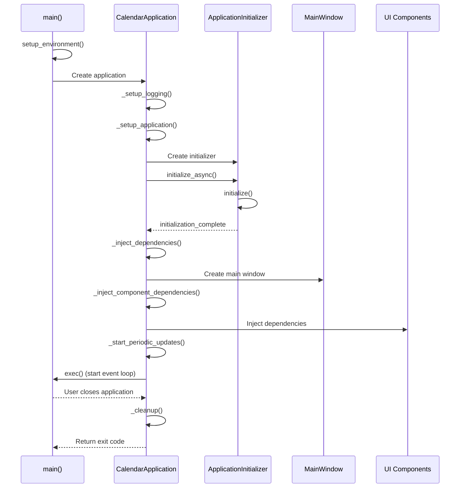

# 🖥️ Desktop Application Lifecycle

This document provides a detailed explanation of the desktop application lifecycle for Calendifier, from startup to shutdown.

## Table of Contents

- [Initialization Phase](#initialization-phase)
- [Component Initialization](#component-initialization)
- [UI Creation](#ui-creation)
- [Runtime Phase](#runtime-phase)
- [Shutdown Phase](#shutdown-phase)
- [Error Handling](#error-handling)
- [Sequence Diagram](#sequence-diagram)

## Initialization Phase

The initialization phase is handled by the `main()` function in `main.py` and consists of the following steps:

### 1. Environment Setup

```python
def setup_environment():
    # Create application data directory
    app_data_dir = Path.home() / ".calendar_app"
    app_data_dir.mkdir(exist_ok=True)
    
    # Create subdirectories
    (app_data_dir / "data").mkdir(exist_ok=True)
    (app_data_dir / "logs").mkdir(exist_ok=True)
    (app_data_dir / "exports").mkdir(exist_ok=True)
    (app_data_dir / "backups").mkdir(exist_ok=True)
    
    # Set environment variables
    os.environ['CALENDAR_APP_DATA_DIR'] = str(app_data_dir)
```

This function:
- Creates the application data directory in the user's home folder
- Creates subdirectories for data, logs, exports, and backups
- Sets environment variables for the application

### 2. Logging Configuration

```python
def _setup_logging(self):
    log_dir = Path.home() / ".calendar_app" / "logs"
    log_dir.mkdir(parents=True, exist_ok=True)
    
    log_file = log_dir / "calendar_app.log"
    
    # Create formatters
    file_formatter = logging.Formatter('%(asctime)s - %(name)s - %(levelname)s - %(message)s')
    console_formatter = logging.Formatter('%(asctime)s - %(levelname)s - %(message)s')
    
    # Create file handler with UTF-8 encoding
    file_handler = logging.FileHandler(log_file, encoding='utf-8')
    file_handler.setFormatter(file_formatter)
    
    # Create console handler with UTF-8 encoding and error handling
    console_handler = logging.StreamHandler(sys.stdout)
    console_handler.setFormatter(console_formatter)
    
    # Configure root logger
    root_logger = logging.getLogger()
    root_logger.setLevel(logging.INFO)
    root_logger.addHandler(file_handler)
    root_logger.addHandler(console_handler)
```

This method:
- Sets up logging to both file and console
- Configures log formatters and handlers
- Handles Unicode encoding for proper emoji display

### 3. Application Creation

```python
app = CalendarApplication(sys.argv)
```

This creates the main application instance, which:
- Sets application metadata (name, version, organization)
- Configures high DPI display support
- Sets up the application style

### 4. Locale Initialization

```python
def _initialize_startup_locale():
    try:
        from calendar_app.config.settings import SettingsManager
        from pathlib import Path
        
        # Get settings file path
        app_data_dir = Path.home() / ".calendar_app"
        settings_file = app_data_dir / "settings.json"
        
        # Create temporary settings manager to get saved locale
        temp_settings = SettingsManager(settings_file)
        saved_locale = temp_settings.get_locale()
        
        # Set the locale immediately and force reload
        set_locale(saved_locale)
        
        # Force reload the I18n manager to ensure latest translations
        from calendar_app.localization.i18n_manager import get_i18n_manager
        manager = get_i18n_manager()
        manager.reload_translations()
    except Exception as e:
        print(f"⚠️ Early locale initialization failed: {e}")
        set_locale('en_GB')  # Use en_GB as fallback to match our default settings
```

This function:
- Loads the saved locale from settings
- Sets the locale immediately before any UI creation
- Forces a reload of translations
- Falls back to 'en_GB' if there's an error

## Component Initialization

Component initialization is handled by the `ApplicationInitializer` class and is performed asynchronously to avoid blocking the UI:

```python
def initialize(self):
    try:
        # Get application data directory
        app_data_dir = Path.home() / ".calendar_app"
        
        # Step 1: Initialize settings
        self.progress_update.emit(f"{UI_EMOJIS['settings']} Initializing settings...")
        settings_file = app_data_dir / "settings.json"
        self.settings_manager = SettingsManager(settings_file)
        
        # Step 2: Initialize localization FIRST
        self.progress_update.emit(f"{UI_EMOJIS['loading']} Initializing localization...")
        saved_locale = self.settings_manager.get_locale()
        if not saved_locale or saved_locale == 'en_GB':  # If no saved locale or default
            # Detect system locale
            locale_detector = LocaleDetector()
            detected_locale = locale_detector.detect_system_locale()
            if detected_locale != 'en_GB':  # If system locale is different from default
                saved_locale = detected_locale
                self.settings_manager.set_locale(saved_locale)  # Save the detected locale
        
        # Set the global locale IMMEDIATELY before creating any UI
        set_locale(saved_locale)
        
        # Use the existing global I18n manager instead of creating a new one
        from calendar_app.localization.i18n_manager import get_i18n_manager
        self.i18n_manager = get_i18n_manager()
        
        # Ensure the global manager is using the correct locale
        self.i18n_manager.set_locale(saved_locale)
        self.i18n_manager.reload_translations()
        
        # Step 3: Initialize theme manager
        self.progress_update.emit(f"{UI_EMOJIS['theme_dark']} Loading themes...")
        self.theme_manager = ThemeManager()
        
        # Step 4: Initialize database
        self.progress_update.emit(f"{UI_EMOJIS['loading']} Setting up database...")
        db_path = app_data_dir / "data" / "calendar.db"
        self.db_manager = DatabaseManager(db_path)
        
        # Step 5: Initialize core managers
        self.progress_update.emit(f"{UI_EMOJIS['event']} Initializing event manager...")
        self.event_manager = EventManager(str(db_path))
        
        self.progress_update.emit(f"{UI_EMOJIS['holiday']} Loading holiday provider...")
        # Get holiday country from settings (or derive from locale)
        holiday_country = self.settings_manager.get_holiday_country()
        if holiday_country == 'GB':  # If still default, try to get from locale
            locale_country = LocaleDetector.get_country_from_locale(saved_locale)
            if locale_country != 'GB':
                holiday_country = locale_country
                self.settings_manager.set_holiday_country(holiday_country)
        self.holiday_provider = MultiCountryHolidayProvider(holiday_country)
        
        self.progress_update.emit(f"{UI_EMOJIS['calendar']} Initializing calendar manager...")
        self.calendar_manager = CalendarManager(self.event_manager, self.holiday_provider)
        
        # Step 6: Initialize NTP client
        self.progress_update.emit(f"{UI_EMOJIS['ntp_status']} Initializing time synchronization...")
        self.ntp_client = NTPClient()
        
        self.progress_update.emit(f"{UI_EMOJIS['success']} Initialization complete!")
        self.initialization_complete.emit(True, "Application initialized successfully")
        
    except Exception as e:
        error_msg = f"Failed to initialize application: {str(e)}"
        logging.error(error_msg, exc_info=True)
        self.initialization_complete.emit(False, error_msg)
```

This method:
1. Initializes settings manager
2. Sets up localization with proper locale detection
3. Initializes theme manager
4. Sets up database connection
5. Initializes event manager
6. Sets up holiday provider with country detection
7. Initializes calendar manager
8. Sets up NTP client for time synchronization

## UI Creation

UI creation is handled by the `_create_main_window()` method:

```python
def _create_main_window(self):
    try:
        logging.info(f"{UI_EMOJIS['app_icon']} Creating main window...")
        
        # Ensure we have valid managers
        if not self.settings_manager or not self.theme_manager:
            raise Exception("Required managers not initialized")
        
        # Create main window with dependency injection
        self.main_window = MainWindow(
            settings_manager=self.settings_manager,
            theme_manager=self.theme_manager
        )
        
        # Inject dependencies into components after main window is created
        self._inject_component_dependencies()
        
        # Apply initial theme
        if self.theme_manager:
            theme = self.theme_manager.current_theme
            qss = self.theme_manager.generate_qss_stylesheet()
            self.setStyleSheet(qss)
        
        # Show main window
        self.main_window.show()
        
        # Start periodic updates
        self._start_periodic_updates()
        
        logging.info(f"{UI_EMOJIS['success']} Application ready!")
        
    except Exception as e:
        error_msg = f"Failed to create main window: {str(e)}"
        logging.error(error_msg, exc_info=True)
        self._show_error_and_exit(error_msg)
```

This method:
1. Creates the main window with dependency injection
2. Injects dependencies into UI components
3. Applies the initial theme
4. Shows the main window
5. Starts periodic update timers

### Dependency Injection

Dependencies are injected into UI components using the `_inject_component_dependencies()` method:

```python
def _inject_component_dependencies(self):
    if not self.main_window:
        return
        
    # Get component references
    try:
        clock_widget = self.main_window.get_clock_widget()
        calendar_widget = self.main_window.get_calendar_widget()
        event_panel = self.main_window.get_event_panel()
    except Exception as e:
        logging.error(f"Failed to get component references: {e}")
        return
    
    # Inject calendar manager into calendar widget via main window
    try:
        if self.main_window and self.calendar_manager:
            if hasattr(self.main_window, 'set_calendar_manager'):
                self.main_window.set_calendar_manager(self.calendar_manager)
                logging.debug("✅ Injected calendar manager and applied all settings via main window")
    except Exception as e:
        logging.warning(f"⚠️ Failed to inject calendar manager: {e}")
    
    # Inject event manager into event panel via main window
    try:
        if self.main_window and self.event_manager:
            if hasattr(self.main_window, 'set_event_manager'):
                self.main_window.set_event_manager(self.event_manager)
                logging.debug("✅ Injected event manager into event panel via main window")
    except Exception as e:
        logging.warning(f"⚠️ Failed to inject event manager: {e}")
    
    # Inject holiday provider into main window for locale-aware translations
    try:
        if self.main_window and self.holiday_provider:
            if hasattr(self.main_window, 'set_holiday_provider'):
                self.main_window.set_holiday_provider(self.holiday_provider)
                logging.debug("✅ Injected holiday provider into main window")
            
            # CRITICAL FIX: Force locale refresh after app is fully initialized
            # This ensures holidays are displayed in the correct language from startup
            self.holiday_provider.force_locale_refresh()
            logging.debug("✅ Forced holiday provider locale refresh after app initialization")
    except Exception as e:
        logging.warning(f"⚠️ Failed to inject holiday provider: {e}")
    
    # Inject NTP client into clock widget with TimeManager
    try:
        if clock_widget and self.ntp_client:
            from calendar_app.utils.ntp_client import TimeManager
            time_manager = TimeManager()
            clock_widget.set_time_manager(time_manager)
            clock_widget.set_ntp_client(self.ntp_client)
            logging.debug("✅ Injected NTP client and time manager into clock widget")
    except Exception as e:
        logging.warning(f"⚠️ Failed to inject NTP client: {e}")
```

This method:
1. Gets references to UI components
2. Injects the calendar manager into the calendar widget
3. Injects the event manager into the event panel
4. Injects the holiday provider into the main window
5. Injects the NTP client into the clock widget

## Runtime Phase

During the runtime phase, the application:

1. **Handles User Input**:
   - Mouse and keyboard events
   - Menu and toolbar actions
   - Dialog interactions

2. **Updates UI Components**:
   - Calendar navigation
   - Event creation/editing
   - Note taking
   - Settings changes

3. **Performs Periodic Updates**:
   - NTP synchronization
   - Holiday cache clearing
   - Automatic data backup

```python
def _start_periodic_updates(self):
    # NTP sync timer (every 30 minutes)
    if self.ntp_client:
        ntp_timer = QTimer()
        ntp_timer.timeout.connect(lambda: self._sync_ntp_safe())
        ntp_timer.start(30 * 60 * 1000)  # 30 minutes
        
        # Initial sync
        QTimer.singleShot(1000, self._sync_ntp_safe)  # Delay initial sync
    
    # Holiday cache clear timer (daily at midnight)
    if self.holiday_provider:
        holiday_timer = QTimer()
        holiday_timer.timeout.connect(self.holiday_provider.clear_cache)
        holiday_timer.start(24 * 60 * 60 * 1000)  # 24 hours
```

This method:
1. Sets up a timer for NTP synchronization every 30 minutes
2. Schedules an initial NTP sync after a short delay
3. Sets up a timer to clear the holiday cache daily

## Shutdown Phase

The shutdown phase is handled by the `_cleanup()` method:

```python
def _cleanup(self):
    logging.info(f"{UI_EMOJIS['loading']} Cleaning up application resources...")
    
    try:
        # Settings are auto-saved, no explicit save needed
        
        # Close database connections
        if self.db_manager:
            # Database connections are handled automatically
            pass
        
        # Clean up threads
        if self.init_thread and self.init_thread.isRunning():
            self.init_thread.quit()
            self.init_thread.wait()
        
        logging.info(f"{UI_EMOJIS['success']} Cleanup complete")
        
    except Exception as e:
        logging.error(f"Error during cleanup: {str(e)}", exc_info=True)
```

This method:
1. Performs cleanup operations before application exit
2. Ensures threads are properly terminated
3. Logs the cleanup process

## Error Handling

Error handling is implemented throughout the application lifecycle:

1. **Initialization Errors**:
   - Displayed in an error dialog
   - Logged to the log file
   - Application exits gracefully

2. **Runtime Errors**:
   - Caught and logged
   - UI remains responsive
   - User is notified when appropriate

3. **Shutdown Errors**:
   - Logged but not displayed to user
   - Application exits regardless

```python
def _show_error_and_exit(self, message: str):
    QMessageBox.critical(
        None,
        f"{UI_EMOJIS['error']} Application Error",
        f"Failed to start Calendar Application:\n\n{message}\n\n"
        f"Please check the log file for more details."
    )
    self.quit()
```

This method:
1. Shows a critical error message dialog
2. Exits the application

## Sequence Diagram



This sequence diagram illustrates the complete application lifecycle from startup to shutdown.