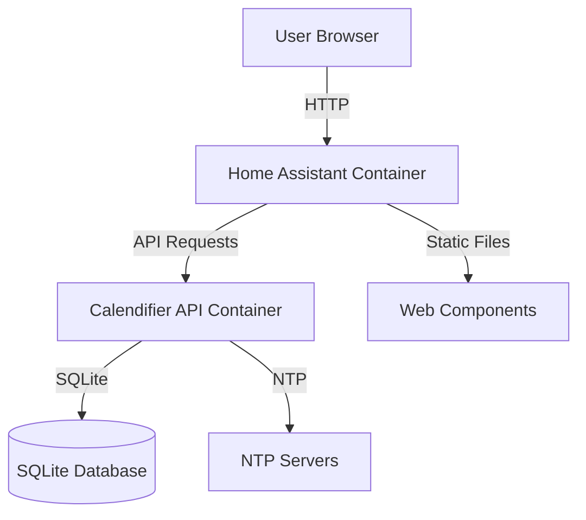

# 🏠 Home Assistant Deployment

This document provides a detailed explanation of the Home Assistant deployment process for Calendifier, including setup, configuration, and integration.

## Table of Contents

- [Deployment Architecture](#deployment-architecture)
- [Deployment Process](#deployment-process)
- [Docker Containers](#docker-containers)
- [Home Assistant Configuration](#home-assistant-configuration)
- [Lovelace Dashboard](#lovelace-dashboard)
- [Web Components](#web-components)
- [API Server](#api-server)
- [Troubleshooting](#troubleshooting)

## Deployment Architecture

The Home Assistant integration of Calendifier consists of two main Docker containers:

1. **Calendifier API Container**:
   - FastAPI server providing calendar data
   - SQLite database for event and note storage
   - Holiday provider for 40 countries
   - Event manager with recurring event support
   - NTP client for time synchronization

2. **Home Assistant Container**:
   - Home Assistant core
   - Lovelace UI
   - Calendifier web components
   - Dashboard configuration

These containers communicate with each other over the network, with the Home Assistant container making API requests to the Calendifier API container.



## Deployment Process

The deployment process is handled by two scripts:

1. **Deployment Script** (`deploy-ha.sh` or `Deploy-HA.ps1`):
   - Runs on the user's development machine
   - Packages the application files
   - Transfers them to the target server (Raspberry Pi or Linux server)
   - Initiates the setup script

2. **Setup Script** (`setup-pi.sh`):
   - Runs on the target server
   - Creates Docker containers
   - Configures Home Assistant
   - Sets up the Lovelace dashboard

### Deployment Script

The deployment script (`deploy-ha.sh` for Linux/Mac or `Deploy-HA.ps1` for Windows) performs the following steps:

```bash
# Create tar archive
tar -czf calendifier-deploy.tar.gz \
    api_server.py \
    main.py \
    requirements.txt \
    api_requirements.txt \
    docker-compose.yml \
    Dockerfile.api \
    version.py \
    setup-pi.sh \
    lovelace-calendifier-config.yaml \
    www \
    calendar_app \
    assets \
    docs

# Send everything in one command
cat calendifier-deploy.tar.gz | ssh -o StrictHostKeyChecking=no "$PI_USER@$PI_IP" "$REMOTE_SCRIPT"
```

This script:
1. Creates a tar archive containing all necessary files
2. Transfers the archive to the target server
3. Extracts the archive on the target server
4. Moves files to the appropriate directories
5. Sets file permissions

### Setup Script

The setup script (`setup-pi.sh`) performs the following steps:

```bash
# Create directories
mkdir -p "$HA_CONFIG_DIR"
mkdir -p "$HA_CONFIG_DIR/www"
mkdir -p "$HA_CONFIG_DIR/custom_components"
mkdir -p "$CALENDIFIER_DIR/data"
mkdir -p "$CALENDIFIER_DIR/logs"

# Copy web components
cp "$CALENDIFIER_DIR/www/"* "$HA_CONFIG_DIR/www/"

# Create Home Assistant configuration
cat > "$HA_CONFIG_DIR/configuration.yaml" << 'EOF'
# Home Assistant Configuration with Calendifier integration
...
EOF

# Create Lovelace dashboard
cp "$CALENDIFIER_DIR/lovelace-calendifier-config.yaml" "$HA_CONFIG_DIR/calendifier.yaml"

# Create Docker Compose configuration
cat > "$CALENDIFIER_DIR/docker-compose.yml" << EOF
services:
  calendifier-api:
    container_name: calendifier-api
    build:
      context: .
      dockerfile: Dockerfile.api
    volumes:
      - $CALENDIFIER_DIR:/app:rw
      - $CALENDIFIER_DIR/data:/app/data:rw
      - $CALENDIFIER_DIR/logs:/app/logs:rw
      - $CALENDIFIER_DIR/www:/app/www:ro
      - $HA_CONFIG_DIR/www:/app/static:rw
    ports:
      - "$CALENDIFIER_API_PORT:8000"
    restart: unless-stopped
    ...

  homeassistant:
    container_name: homeassistant
    image: homeassistant/home-assistant:stable
    volumes:
      - $HA_CONFIG_DIR:/config:rw
      - $CALENDIFIER_DIR/www:/config/www:rw
      - /etc/localtime:/etc/localtime:ro
    restart: unless-stopped
    ...
EOF

# Build and start containers
cd "$CALENDIFIER_DIR"
$COMPOSE_CMD build calendifier-api
$COMPOSE_CMD up -d
```

This script:
1. Creates necessary directories
2. Copies web components to Home Assistant
3. Creates Home Assistant configuration
4. Creates Lovelace dashboard configuration
5. Creates Docker Compose configuration
6. Builds and starts the Docker containers

## Docker Containers

### Calendifier API Container

The Calendifier API container is built using the following Dockerfile:

```dockerfile
FROM python:3.11-slim

WORKDIR /app

# Install system dependencies
RUN apt-get update && apt-get install -y \
    curl \
    && rm -rf /var/lib/apt/lists/*

# Copy requirements first for better caching
COPY api_requirements.txt requirements.txt ./
RUN pip install --no-cache-dir -r api_requirements.txt

# Copy application code
COPY . .

# Create necessary directories
RUN mkdir -p /app/data /app/logs

# Set permissions
RUN chmod +x /app/api_server.py

# Expose port
EXPOSE 8000

# Health check
HEALTHCHECK --interval=30s --timeout=10s --start-period=5s --retries=3 \
    CMD curl -f http://localhost:8000/api/status || exit 1

# Run the application
CMD ["python", "api_server.py"]
```

This container:
- Uses Python 3.11 as the base image
- Installs required dependencies
- Sets up the application code
- Configures health checks
- Runs the API server

### Home Assistant Container

The Home Assistant container uses the official Home Assistant image:

```yaml
homeassistant:
  container_name: homeassistant
  image: homeassistant/home-assistant:stable
  volumes:
    - $HA_CONFIG_DIR:/config:rw
    - $CALENDIFIER_DIR/www:/config/www:rw
    - /etc/localtime:/etc/localtime:ro
  restart: unless-stopped
  privileged: true
  ports:
    - "$HA_PORT:8123"
  environment:
    - TZ=${TZ:-UTC}
  depends_on:
    - calendifier-api
  networks:
    - calendifier-network
  healthcheck:
    test: ["CMD", "curl", "-f", "http://localhost:8123"]
    interval: 30s
    timeout: 10s
    retries: 3
```

This container:
- Uses the official Home Assistant image
- Mounts configuration and web component volumes
- Exposes the Home Assistant web interface
- Depends on the Calendifier API container
- Configures health checks

## Home Assistant Configuration

The Home Assistant configuration is created by the setup script:

```yaml
# Home Assistant Configuration with Calendifier integration

# Configure a default setup of Home Assistant (frontend, api, etc)
default_config:

# Enable the frontend with Calendifier loader
frontend:
  extra_module_url:
    - /local/calendifier-loader.js

# Enable lovelace yaml mode for custom dashboard
lovelace:
  mode: yaml
  resources: []
  dashboards:
    calendifier-dashboard:
      mode: yaml
      title: Calendifier
      icon: mdi:calendar
      show_in_sidebar: true
      filename: calendifier.yaml
      require_admin: false

# HTTP configuration
http:
  use_x_forwarded_for: true
  trusted_proxies:
    - 172.16.0.0/12
    - 192.168.0.0/16
    - 10.0.0.0/8

# Text to speech
tts:
  - platform: google_translate

# Calendifier API integration
rest_command:
  calendifier_api:
    url: "http://localhost:8000/api/{{ endpoint }}"
    method: "{{ method | default('GET') }}"
    headers:
      Content-Type: application/json
    payload: "{{ payload | default('') }}"
```

This configuration:
- Sets up the basic Home Assistant configuration
- Enables the frontend with Calendifier loader
- Configures Lovelace in YAML mode
- Sets up the Calendifier dashboard
- Configures HTTP settings
- Sets up the Calendifier API integration

## Lovelace Dashboard

The Lovelace dashboard is configured in `calendifier.yaml`:

```yaml
# Beautiful Calendifier Dashboard with RRule Support - Wide Cards Layout
title: Calendar System
views:
  - title: Calendar System
    path: calendifier
    icon: mdi:calendar
    type: masonry
    layout:
      width: 400
      max_cols: 2
    cards:
      # Row 1: Clock and Help Cards (Side by Side) - Wide Layout
      - type: horizontal-stack
        cards:
          - type: custom:calendifier-clock-card
            title: "🕐 Time"
          - type: custom:calendifier-help-card
            title: "⚙️ Settings"
      
      # Row 2: Calendar View (Full Width) - Extra Wide with RRule Support
      - type: custom:calendifier-calendar-card
        title: "📅 Calendar View"
      
      # Row 3: Events and Notes (Side by Side) - Wide Layout with RRule Support
      - type: horizontal-stack
        cards:
          - type: custom:calendifier-events-card
            title: "📋 Events"
            max_events: 5
          - type: custom:calendifier-notes-card
            title: "📝 Notes"
      
      # Row 4: Data Management (Full Width) - Extra Wide
      - type: custom:calendifier-data-card
        title: "💾 Data Management"
```

This dashboard:
- Creates a masonry layout with 2 columns
- Sets up a clock and help card in the first row
- Adds a full-width calendar card in the second row
- Includes events and notes cards in the third row
- Adds a data management card in the fourth row

## Web Components

The web components are copied to the Home Assistant `www` directory:

```bash
cp "$CALENDIFIER_DIR/www/"* "$HA_CONFIG_DIR/www/"
```

These components include:

1. **Base Card** (`calendifier-base-card.js`):
   - Common functionality for all cards
   - Translation support
   - Event handling
   - API communication

2. **Calendar Card** (`calendifier-calendar-card.js`):
   - Monthly calendar view
   - Event display
   - Holiday integration
   - Navigation controls

3. **Events Card** (`calendifier-events-card.js`):
   - Event list display
   - Event creation/editing
   - Event filtering
   - Recurring event support

4. **Clock Card** (`calendifier-clock-card.js`):
   - Analog clock display
   - NTP synchronization
   - Time zone support

5. **Notes Card** (`calendifier-notes-card.js`):
   - Note taking functionality
   - Note categorization
   - Note search

6. **RRule Builder** (`rrule-builder.js`):
   - Recurring event pattern builder
   - RFC 5545 RRULE support
   - Visual pattern preview
   - Full translation support

7. **Loader** (`calendifier-loader.js`):
   - Loads all Calendifier components
   - Handles dependencies
   - Manages initialization

## API Server

The API server is started in the Calendifier API container:

```bash
CMD ["python", "api_server.py"]
```

The API server provides the following endpoints:

1. **Events API**:
   - GET `/api/v1/events` - Get all events
   - POST `/api/v1/events` - Create new event
   - PUT `/api/v1/events/{event_id}` - Update event
   - DELETE `/api/v1/events/{event_id}` - Delete event
   - GET `/api/v1/events/expanded` - Get events with recurring events expanded

2. **Notes API**:
   - GET `/api/v1/notes` - Get all notes
   - POST `/api/v1/notes` - Create new note
   - DELETE `/api/v1/notes/{note_id}` - Delete note

3. **Holidays API**:
   - GET `/api/v1/holidays/{country}/{year}/{month}` - Get holidays for month
   - GET `/api/v1/holidays/auto/{year}` - Get holidays for year (auto-detect country)
   - GET `/api/v1/holidays/countries` - Get supported countries

4. **Settings API**:
   - GET `/api/v1/settings` - Get all settings
   - PUT `/api/v1/settings` - Update settings

5. **Translations API**:
   - GET `/api/v1/translations` - Get available translations
   - GET `/api/v1/translations/{locale}` - Get translations for locale

6. **NTP API**:
   - GET `/api/v1/ntp/status` - Get NTP status
   - POST `/api/v1/ntp/sync` - Trigger NTP sync

7. **Import/Export API**:
   - GET `/api/v1/export/events` - Export events
   - GET `/api/v1/export/notes` - Export notes
   - GET `/api/v1/export/all` - Export all data
   - POST `/api/v1/import/events` - Import events
   - POST `/api/v1/import/notes` - Import notes

## Troubleshooting

### Common Issues

1. **Calendifier Menu Not Appearing**:
   - Restart Home Assistant
   - Clear browser cache
   - Check that the setup script completed without errors

2. **Cannot SSH to Pi**:
   - Ensure SSH is enabled on your Raspberry Pi
   - Check that you're using the correct IP address
   - Verify your Pi is connected to the network

3. **Deploy Script Fails**:
   - Ensure you have PowerShell execution policy set correctly
   - Check your network connection to the Pi
   - Verify the Pi's IP address is correct

4. **API Server Not Responding**:
   - Check Docker container logs
   - Verify the API container is running
   - Check network connectivity between containers

5. **Web Components Not Loading**:
   - Check browser console for errors
   - Verify components are copied to the correct directory
   - Clear browser cache

### Checking Container Status

```bash
docker ps
```

This command shows the status of running containers.

### Viewing Container Logs

```bash
docker logs calendifier-api
docker logs homeassistant
```

These commands show the logs for the respective containers.

### Restarting Containers

```bash
docker restart calendifier-api
docker restart homeassistant
```

These commands restart the respective containers.

### Rebuilding Containers

```bash
cd "$CALENDIFIER_DIR"
docker-compose build calendifier-api
docker-compose up -d
```

These commands rebuild and restart the containers.