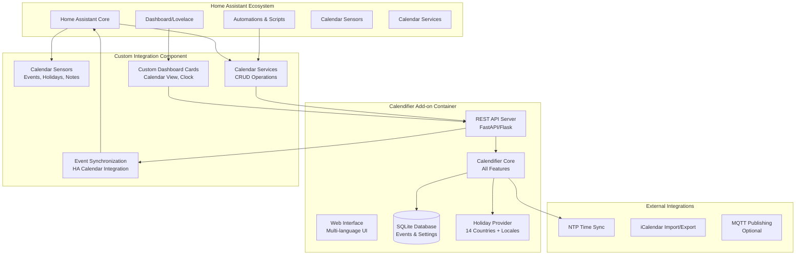
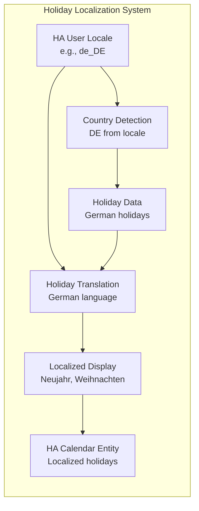

# 🏠 Home Assistant Integration Plan for Calendifier

## 🎯 Overview

This document outlines the comprehensive integration plan for bringing Calendifier's full feature set into Home Assistant, including UI, internationalization, clock, calendar, events, notes, timezones, and **locale-correct holidays**.

## 🏗️ Architecture Overview

### Integration Strategy: Multi-Component Approach



## 🌍 Enhanced Locale-Aware Holiday System

### Current State Analysis
Calendifier already has excellent holiday support with:
- 14 country holiday providers
- Multi-language holiday translations
- Intelligent locale detection
- Cultural filtering

### Home Assistant Integration Enhancement



**Key Enhancements**:
1. **Home Assistant Locale Integration**: Automatically detect and use HA's configured locale
2. **Dynamic Holiday Updates**: Holidays update when HA locale changes
3. **Calendar Entity Integration**: Holidays appear as HA calendar events
4. **Automation Triggers**: Holiday-based automation triggers with localized names

## 📦 Implementation Components

### 1. Home Assistant Add-on (`calendifier-addon`)

**Purpose**: Containerized Calendifier service with web interface

**Features**:
- Full Calendifier application accessible via web browser
- REST API for Home Assistant integration
- Persistent data storage with volume mounts
- Multi-language support (all 14 languages)
- Locale-aware holiday system (all 14 countries)
- NTP time synchronization
- Import/Export capabilities (iCal, CSV, JSON)
- Real-time WebSocket updates

**Technical Stack**:
- **Backend**: FastAPI with existing Calendifier core
- **Frontend**: React/Vue.js with responsive design
- **Database**: SQLite (existing schema)
- **Container**: Alpine Linux with Python 3.11+

### 2. Custom Integration Component (`calendifier_integration`)

**Purpose**: Native Home Assistant integration providing entities and services

**Entities Provided**:
- `calendar.calendifier_events` - Main calendar entity
- `sensor.calendifier_next_event` - Next upcoming event
- `sensor.calendifier_today_events` - Today's event count
- `sensor.calendifier_next_holiday` - Next holiday with localized name
- `sensor.calendifier_notes_count` - Number of notes
- `sensor.calendifier_ntp_status` - NTP synchronization status
- `binary_sensor.calendifier_holiday_today` - Is today a holiday

**Services Provided**:
- `calendifier.create_event` - Create new event
- `calendifier.update_event` - Update existing event
- `calendifier.delete_event` - Delete event
- `calendifier.create_note` - Create new note
- `calendifier.sync_time` - Force NTP synchronization
- `calendifier.import_calendar` - Import calendar data
- `calendifier.export_calendar` - Export calendar data

### 3. Custom Dashboard Cards (`calendifier-cards`)

**Purpose**: Rich Lovelace cards for interactive calendar management

**Cards Provided**:
- **Calendar Card**: Full month/week/day view with event management
- **Clock Card**: Analog clock with NTP status and timezone display
- **Event Card**: Upcoming events list with quick actions
- **Notes Card**: Note management interface
- **Holiday Card**: Holiday information with cultural context

## 🔧 Detailed Technical Implementation

### Phase 1: Core Add-on Development (Weeks 1-6)

#### 1.1 Web Interface Conversion
Convert existing PySide6 UI to web-based interface while preserving all functionality:

**Frontend Architecture**:
```
calendifier-web/
├── src/
│   ├── components/
│   │   ├── Calendar/
│   │   │   ├── CalendarView.vue
│   │   │   ├── EventDialog.vue
│   │   │   └── MonthNavigation.vue
│   │   ├── Clock/
│   │   │   ├── AnalogClock.vue
│   │   │   └── NTPStatus.vue
│   │   ├── Notes/
│   │   │   ├── NotesWidget.vue
│   │   │   └── NoteEditor.vue
│   │   └── Settings/
│   │       ├── SettingsDialog.vue
│   │       └── LocaleSelector.vue
│   ├── i18n/
│   │   ├── en.json
│   │   ├── de.json
│   │   └── [all 14 languages]
│   ├── stores/
│   │   ├── calendar.js
│   │   ├── events.js
│   │   ├── settings.js
│   │   └── holidays.js
│   └── utils/
│       ├── api.js
│       ├── dateUtils.js
│       └── localization.js
```

#### 1.2 REST API Development
FastAPI-based REST API maintaining all existing functionality:

**API Endpoints**:
```
GET    /api/v1/calendar/{year}/{month}     # Get calendar data
GET    /api/v1/events                      # List events
POST   /api/v1/events                      # Create event
PUT    /api/v1/events/{id}                 # Update event
DELETE /api/v1/events/{id}                 # Delete event
GET    /api/v1/holidays/{year}             # Get holidays
GET    /api/v1/notes                       # List notes
POST   /api/v1/notes                       # Create note
GET    /api/v1/settings                    # Get settings
PUT    /api/v1/settings                    # Update settings
GET    /api/v1/ntp/status                  # NTP status
POST   /api/v1/ntp/sync                    # Force NTP sync
POST   /api/v1/import                      # Import calendar
GET    /api/v1/export                      # Export calendar
WS     /api/v1/ws                          # WebSocket updates
```

#### 1.3 Enhanced Holiday Localization
Extend existing holiday provider for Home Assistant integration:

```python
class HomeAssistantHolidayProvider(MultiCountryHolidayProvider):
    def __init__(self, hass_config=None):
        self.hass_config = hass_config
        
        # Get locale from Home Assistant or detect from system
        if hass_config:
            locale = hass_config.get('language', 'en_US')
            country = hass_config.get('country') or self._detect_country_from_locale(locale)
        else:
            locale_detector = LocaleDetector()
            locale = locale_detector.detect_system_locale()
            country = locale_detector.get_country_from_locale(locale)
        
        super().__init__(country)
        self.current_locale = locale
        
    def get_localized_holidays_for_ha(self, year: int) -> List[Dict]:
        """Get holidays formatted for Home Assistant calendar entity"""
        holidays = self.get_holidays_for_year(year)
        
        return [
            {
                'summary': self._get_localized_holiday_name(holiday),
                'start': holiday.date.isoformat(),
                'end': holiday.date.isoformat(),
                'all_day': True,
                'description': holiday.description or '',
                'location': f"{holiday.country_code} Holiday",
                'uid': f"holiday_{holiday.country_code}_{holiday.date.isoformat()}_{holiday.name.replace(' ', '_')}"
            }
            for holiday in holidays
        ]
```

### Phase 2: Home Assistant Integration (Weeks 7-10)

#### 2.1 Custom Component Structure
```
custom_components/calendifier/
├── __init__.py              # Component initialization
├── manifest.json            # Component manifest
├── config_flow.py          # Configuration flow
├── const.py                # Constants
├── calendar.py             # Calendar platform
├── sensor.py               # Sensor platform
├── binary_sensor.py        # Binary sensor platform
├── services.yaml           # Service definitions
├── strings.json            # UI strings
└── translations/           # Translations for all languages
    ├── en.json
    ├── de.json
    └── [all 14 languages]
```

#### 2.2 Calendar Platform Integration
```python
class CalendifierCalendar(CalendarEntity):
    """Calendifier calendar entity."""
    
    def __init__(self, api_client, config):
        self._api_client = api_client
        self._config = config
        self._events = []
        
    @property
    def event(self):
        """Return the next upcoming event."""
        now = datetime.now()
        upcoming = [e for e in self._events if e['start'] > now]
        return upcoming[0] if upcoming else None
    
    async def async_get_events(self, hass, start_date, end_date):
        """Get events in date range."""
        events = await self._api_client.get_events(start_date, end_date)
        holidays = await self._api_client.get_holidays(start_date.year)
        
        # Combine events and holidays
        all_events = events + holidays
        
        return [
            CalendarEvent(
                start=event['start'],
                end=event['end'],
                summary=event['summary'],
                description=event.get('description', ''),
                location=event.get('location', ''),
                uid=event.get('uid', '')
            )
            for event in all_events
        ]
```

### Phase 3: Dashboard Cards (Weeks 11-14)

#### 3.1 Custom Calendar Card
```javascript
class CalendifierCalendarCard extends LitElement {
    static get properties() {
        return {
            hass: {},
            config: {},
            currentDate: { type: Object },
            events: { type: Array },
            holidays: { type: Array }
        };
    }
    
    render() {
        return html`
            <ha-card header="${this.config.title || 'Calendar'}">
                <div class="calendar-container">
                    <calendifier-month-view
                        .currentDate=${this.currentDate}
                        .events=${this.events}
                        .holidays=${this.holidays}
                        .locale=${this.hass.locale}
                        @date-selected=${this._handleDateSelected}
                        @event-clicked=${this._handleEventClicked}
                    ></calendifier-month-view>
                </div>
            </ha-card>
        `;
    }
    
    _handleDateSelected(e) {
        // Handle date selection for event creation
        this._showEventDialog(e.detail.date);
    }
    
    _handleEventClicked(e) {
        // Handle event editing
        this._showEventDialog(e.detail.date, e.detail.event);
    }
}
```

## 📋 Feature Mapping

| Calendifier Feature | Home Assistant Integration | Implementation |
|-------------------|---------------------------|----------------|
| **Calendar View** | Custom Lovelace card | React/Vue calendar component |
| **Events** | Calendar entities + CRUD services | REST API + HA services |
| **Holidays** | Sensor entities with locale names | Enhanced holiday provider |
| **Clock Widget** | Custom clock card with NTP | Analog clock component |
| **Notes** | Text sensor + management services | Notes API + HA services |
| **Themes** | HA theme integration | CSS custom properties |
| **Languages** | Full i18n in cards/services | Translation files |
| **Timezones** | HA timezone integration | Timezone-aware API |
| **Import/Export** | Service calls | File upload/download API |
| **Settings** | Configuration via HA | Config flow + options |

## 🚀 Development Roadmap

### Week 1-2: Planning & Setup
- [x] Create integration plan
- [ ] Set up Home Assistant development environment
- [ ] Create add-on repository structure
- [ ] Design web interface mockups
- [ ] Plan API endpoints and data models

### Week 3-4: Add-on Foundation
- [ ] Create Docker container configuration
- [ ] Set up FastAPI server structure
- [ ] Implement basic REST API endpoints
- [ ] Create web interface foundation

### Week 5-6: Core Features
- [ ] Convert calendar functionality to web
- [ ] Implement event management API
- [ ] Add holiday localization for HA
- [ ] Create notes management interface

### Week 7-8: HA Integration
- [ ] Develop custom component structure
- [ ] Implement calendar platform
- [ ] Create sensor entities
- [ ] Add service calls

### Week 9-10: Advanced Integration
- [ ] Implement configuration flow
- [ ] Add WebSocket real-time updates
- [ ] Create automation triggers
- [ ] Test locale switching

### Week 11-12: Dashboard Cards
- [ ] Develop calendar card
- [ ] Create clock widget card
- [ ] Implement event management card
- [ ] Add notes card

### Week 13-14: Polish & Testing
- [ ] Comprehensive testing across locales
- [ ] Performance optimization
- [ ] Documentation completion
- [ ] Community feedback integration

## 🔧 Technical Requirements

### Add-on Requirements
- **Container**: Alpine Linux 3.18+
- **Runtime**: Python 3.11+
- **Web Framework**: FastAPI 0.104+
- **Frontend**: Vue.js 3+ or React 18+
- **Database**: SQLite (existing schema)
- **Dependencies**: All current Calendifier dependencies

### Integration Requirements
- **Home Assistant**: 2024.1+
- **Python**: 3.11+ (HA requirement)
- **Custom Component**: Standard HA structure
- **Configuration**: Config flow with options
- **Translations**: All 14 supported languages

### Card Requirements
- **JavaScript**: ES2022+
- **Framework**: Lit-element 3+
- **Styling**: CSS Grid/Flexbox
- **Real-time**: WebSocket integration
- **Responsive**: Mobile-first design

## 📊 Benefits Summary

### For Users
1. **Seamless Integration**: Calendifier feels native to Home Assistant
2. **Full Feature Access**: All Calendifier features available in HA
3. **Automation Ready**: Events and holidays trigger automations
4. **Multi-Language**: Complete localization support
5. **Responsive Design**: Works perfectly on all devices

### For Developers
1. **Modular Architecture**: Clean separation of concerns
2. **API-First Design**: Easy to extend and integrate
3. **Standard HA Patterns**: Follows HA development best practices
4. **Comprehensive Testing**: Full test coverage
5. **Documentation**: Complete API and integration docs

### For Home Assistant Ecosystem
1. **Rich Calendar Solution**: Professional-grade calendar integration
2. **International Support**: True multi-language, multi-country support
3. **Holiday Intelligence**: Locale-aware holiday system
4. **Time Accuracy**: NTP synchronization for precise timing
5. **Data Portability**: Standard format import/export

## 🎯 Success Metrics

- [ ] All 14 languages working in HA interface
- [ ] All 14 country holidays displaying correctly
- [ ] Sub-second response times for API calls
- [ ] Real-time updates working via WebSocket
- [ ] Mobile-responsive interface
- [ ] Automation triggers functioning
- [ ] Import/export maintaining data integrity
- [ ] NTP synchronization working
- [ ] Theme integration seamless
- [ ] Configuration flow intuitive

## 📚 Next Steps

1. **Review and Approve Plan**: Stakeholder review of this integration plan
2. **Environment Setup**: Prepare Home Assistant development environment
3. **Repository Creation**: Set up add-on and integration repositories
4. **Development Start**: Begin with add-on foundation
5. **Iterative Development**: Regular testing and feedback cycles

---

*This integration plan ensures Calendifier's full feature set is available within Home Assistant while maintaining the high-quality internationalization and locale-aware holiday system that makes Calendifier unique.*